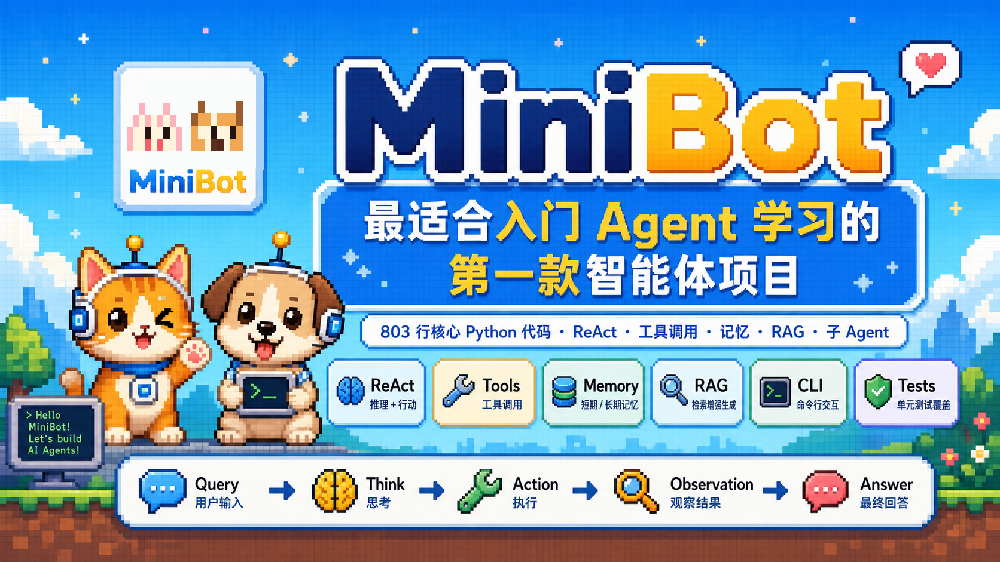
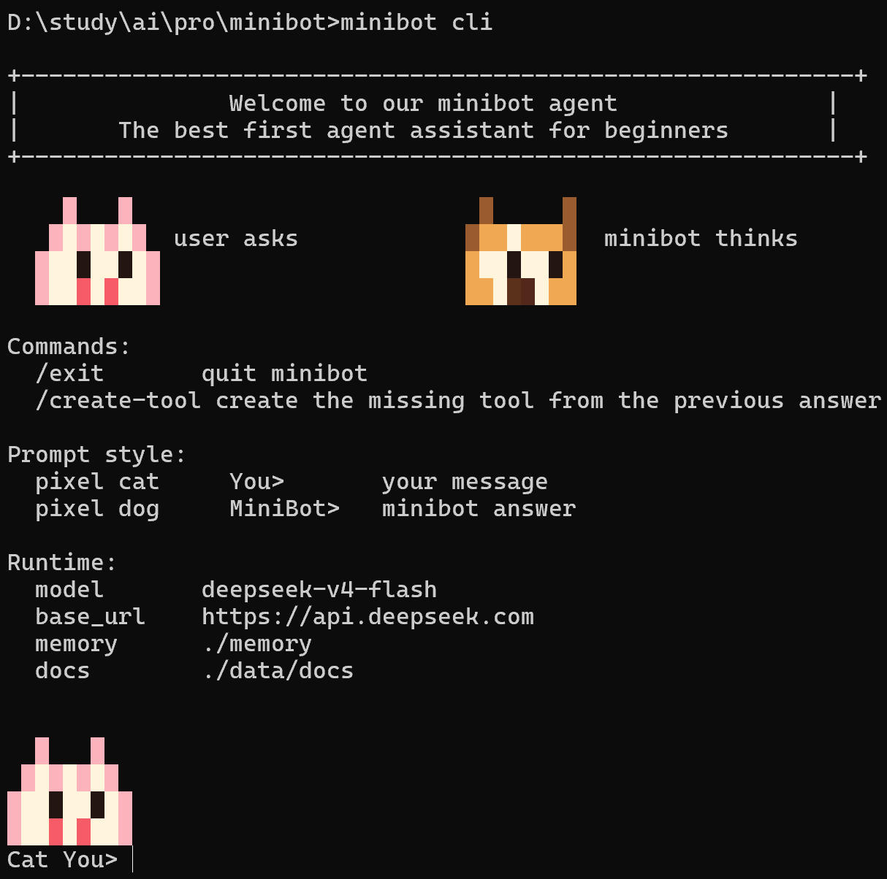
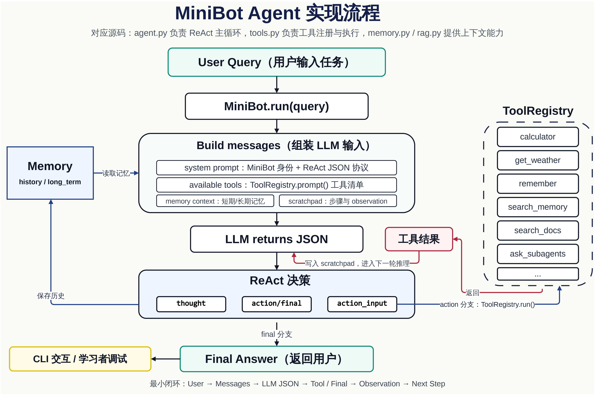

为了方便刚入门Agent的同学了解Agent如何开发，如果直接去看OpenClaw源码有约40w+行代码比较难以理解。于是我写出了MiniBot（约800行核心代码），一款开源免费最适合Agent初学者（最字为夸张表达语法 大佬们见谅orz）阅读和改造的极简智能体项目（Python实现）。

**MiniBot 不是为了做成最复杂、最完整的智能体框架，而是为了让刚开始学习 Agent 的同学，用尽可能精简的 Python 代码，看懂一个智能体到底是怎么运行跑起来的。**

它把一个 Agent 最核心的路径保留下来：

```text
User Query
  -> LLM Thinking
  -> Action / Tool Call
  -> Observation
  -> Final Answer
```

如果你想从零理解 ReAct、工具调用、记忆、RAG、子智能体、命令行交互这些 Agent 基础概念，MiniBot 可以作为你的第一份可运行代码。


## 💡项目受众

MiniBot 适合以下人群：

- 刚开始学习或体验 Agent 的初学者
- 想阅读agent源码理解其流程及设计者
- 想理解 ReAct 智能体最小实现的学习者
- 想从 LangChain、AutoGen 等框架回到基础原理的人
- 想写一个个人专属智能体雏形的开发者
- 想学习工具调用、记忆、RAG、subagent 的同学

前置要求很低：

- 会运行 Python 脚本
- 了解基本函数、类和字典
- 有一个 OpenAI-compatible 模型服务或 API Key

## 🚀快速开始
前提：你自己本地安装过python>3.10环境，没有可以自己电脑装一个对应python环境。
### 1. 克隆项目
新建一个项目文件夹，然后在这个文件夹目录下打开终端一次执行如下命令：
```powershell
git clone https://github.com/demoyu123/minibot.git
cd minibot
```

### 2. 创建虚拟环境（可选 不执行则在全局环境中安装）

```powershell
python -m venv .venv
.\.venv\Scripts\Activate.ps1
```

### 3. 安装所需环境

```powershell
pip install -e .
```

`-e` 表示 editable install。安装后你修改源码，改动会立即生效，适合学习和开发。

### 4. 配置模型
打开minibot.local.env文件编辑替换成你自己的模型key、url、name：

```env
OPENAI_API_KEY=你的真实API Key
OPENAI_BASE_URL=你模型的url
MINIBOT_MODEL=你模型的name
```

### 5. 启动 MiniBot

```powershell
minibot cli
```
成功启动示例图：


## 使用示例

```text
Cat You> 你好

Dog MiniBot>
你好，我是 MiniBot，你的专属个人智能体。我可以帮你处理学习、规划、编码、记忆和工具查询等事情。
```

计算：

```text
Cat You> 2+3*4 等于多少？

Dog MiniBot>
2 + 3 * 4 = 14
```

查询天气：

```text
Cat You> 上海明天天气如何？
```

MiniBot 会让 LLM 调用 `get_weather`，而不是编造结果。


## 🤔Agent 主流程


## 🔧项目定位

MiniBot 的目标很明确：

- 用极简代码讲清楚 Agent 的基本运行机制
- 不依赖复杂框架，尽量只使用 Python 标准库
- 保留真实可运行的 LLM 调用、工具注册、记忆、RAG 和 CLI
- 方便初学者阅读、调试、修改和扩展
- 适合作为学习 Agent 工程结构的第一站

它适合你在读完一些 Agent 概念文章后，真正打开代码，看清楚：

- prompt 是怎样组织的
- LLM 是怎样决定调用工具的
- tool 是怎样注册和执行的
- observation 是怎样回到下一轮推理的
- memory 和 RAG 是怎样进入上下文的
- 一个子 agent 是怎样被主 agent 调用的

## ✨核心特性
### 极简 Agent Loop

核心逻辑集中在 `minibot/agent.py`：

```text
build messages
  -> call LLM
  -> parse JSON
  -> run tool
  -> append observation
  -> final answer
```

没有复杂抽象，也没有重型依赖。你可以很快从入口读到结尾。

### ReAct JSON 协议

MiniBot 要求 LLM 每一步只返回 JSON：

```json
{"thought":"need calculation","action":"calculator","action_input":{"expression":"2+3*4"}}
```

或者：

```json
{"thought":"done","final":"2 + 3 * 4 = 14"}
```

这样初学者可以清楚看到智能体的思考、动作、参数和最终回答。

### 工具系统

内置工具包括：

- `calculator`：计算简单数学表达式
- `get_weather`：查询当前或明天天气
- `remember`：写入长期记忆
- `search_memory`：检索长期记忆
- `search_docs`：检索本地知识库
- `ask_subagent`：同步调用一个子智能体
- `ask_subagents`：并发调用多个子智能体

工具注册在 `minibot/tools.py`，代码短、结构清晰，适合照着添加自己的工具。

### 记忆系统

MiniBot 保留了两类记忆：

- 短期记忆：最近几轮对话，进入每次 prompt
- 长期记忆：写入 `memory/long_term.jsonl`
- 历史记录：写入 `memory/history.jsonl`

这能帮助学习者理解“上下文记忆”和“持久化记忆”的区别。

### 最小 RAG

MiniBot 在 `minibot/rag.py` 中实现了一个最小 RAG：

```text
读取 data/docs
  -> 切分文本
  -> 关键词检索
  -> 把检索结果交给 LLM
```

它不是工业级向量数据库实现，但非常适合学习 RAG 的骨架。理解后，你可以把检索部分替换成 embedding、FAISS、Milvus 或其他向量数据库。

### 子智能体与并发子任务

MiniBot 支持两种子任务方式：

```text
ask_subagent(task)
```

用于把一个小任务交给子 MiniBot。

```text
ask_subagents(tasks)
```

用于把多个独立小任务并发交给多个子 MiniBot。

这不是复杂的多智能体框架，而是一个足够小、足够容易读懂的 subagent 示例。

### 命令行个人智能体体验

MiniBot 现在默认设定为用户的专属个人智能体 agent，并提供一个轻量 CLI：

- 彩色马赛克小猫 / 小狗提示
- `MiniBot is thinking...` 思考动画
- `/exit` 或 `/quit` 退出
- 退出时显示 `Goodbye, see you next time~`


## 📚项目结构

```text
minibot/
  agent.py          # MiniBot 主循环：ReAct、tool call、subagent
  cli.py            # 命令行入口与交互体验
  config.py         # 加载 minibot.local.env
  llm.py            # OpenAI-compatible HTTP 调用与 FakeLLM
  memory.py         # 短期记忆、长期记忆、历史记录
  rag.py            # 最小 RAG：文档读取、切分、关键词检索
  tools.py          # Tool 与 ToolRegistry，内置工具
  tool_builder.py   # 缺失工具模板生成
data/docs/          # 本地知识库文档
examples/           # 示例脚本
tests/              # 单元测试
```

## ⭐为什么适合初学者

很多 Agent 项目很强大，但初学者刚打开时容易迷路：配置多、依赖多、抽象多、目录深。

MiniBot 刻意反过来做：

- 能用标准库就不用第三方依赖
- 能用一个文件讲清楚就不拆太多层
- 能直接读懂就不提前抽象
- 先讲清楚主流程，再逐步扩展工具、记忆、RAG 和子 agent

它不是终点，而是一张清晰的起点地图。

## 😀开发与测试（可选 检测项目环境代码是否成功）

运行测试：

```powershell
python -m unittest discover -s tests -v
```

运行示例：

```powershell
python examples/demo_fake_llm.py
```

检查语法：

```powershell
python -m py_compile minibot\agent.py minibot\cli.py minibot\tools.py
```


## 😘结语

MiniBot 希望做的是更小的一步：用一份极简 Python 代码，帮你真正读懂 Agent 的第一圈闭环。

如果大家喜欢并关注，后续我也会持续更新维护MiniBot 欢迎大家下载运行阅读源码学习。
记得点一个star哟~~
